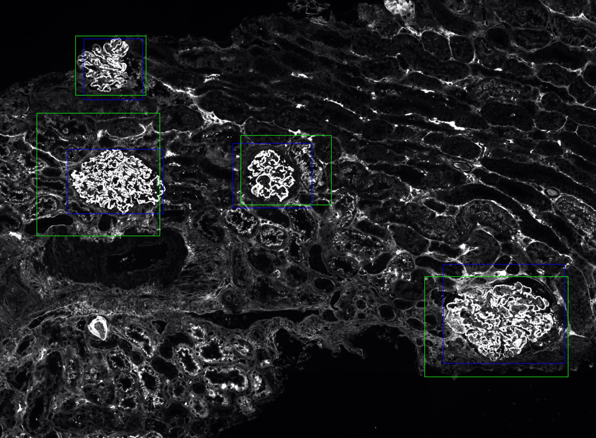

# Glomeruli Detection

This repository contains a project aimed at detecting glomeruli in histopathological images using deep learning techniques. The goal is to build an automated system for identifying and segmenting glomeruli regions in tissue slide images, which is useful for various medical applications, including kidney disease diagnosis.

## Project Overview

The project uses **YOLOv8**, a state-of-the-art object detection model, to identify glomeruli in large-scale Whole Slide Images (WSI). The dataset used for training and validation contains annotations in the form of bounding boxes around glomeruli regions. The detection model is trained on these annotated data, and the output includes bounding boxes that mark the predicted glomeruli locations.

## Dataset

The dataset consists of 195 Whole Slide images (WSIs), of which 185 have been annotated by drawing a bounding box around each identified glomerulus. Each WSI is opened using the OpenSlide library, selecting the second resolution level (level 1, less detailed compared to level 0) to facilitate processing.

## Segmentation

Each WSI underwent a pre-processing step to separate the tissue portion from the background, resulting in a segmentation mask.

**Loading and Conversion**: The input image (WSI) is converted to grayscale to simplify further processing.

**Processing**: A binary mask is then generated, where pixels representing tissue are assigned a value of 1 (white), while background pixels are assigned a value of 0 (black). Pixels are selected based on a specified range of intensity values between a defined lower and upper bound. Morphological operations are subsequently applied to refine the mask by expanding tissue contours, filling small holes, and connecting adjacent regions, thereby improving segmentation quality.

**Validation**: Patch selection is guided by the generated mask, considering only patches containing a sufficient amount of tissue. Specifically, a patch is discarded if more than 80% of its area consists of background (i.e., it contains little to no tissue).

**Saving and Visualization:** The segmented mask is saved and overlaid on the WSI to facilitate visual inspection.

## Patch Division  
The tissue area resulting from the segmentation of each WSI was divided into patches of 1,024 x 1,024 pixels, with a 50% overlap both vertically and horizontally, to reduce the likelihood of a glomerulus being fragmented between adjacent patches. A total of 56,889 patches were extracted.

**Split Generation**  
The WSIs were divided into two distinct sets: one for training the model and the other for evaluation (testing). This separation allowed the artificial intelligence model to be trained on the first set and its performance to be evaluated on the second.

**Training of the Glomerulus Detection Model**  
The experiments conducted are all based on the YOLO v8 model. The training used only the patches from the training set.

**Model Prediction on Testing Patches**  
The trained model was applied to the test images and generated bounding boxes on the individual test patches where it detected the presence of a glomerulus or part of it.

**WSI Reconstruction**  
The individual test patches were aggregated into the original WSI to globally display the model's predicted bounding boxes (green).

Hand-annotated boxes (blue) were also overlaid on the same map.

To merge bounding boxes from adjacent patches on the same map, a merging process was applied. Specifically, for each predicted bounding box, the overlap ratio with all other bounding boxes is calculated, defined as the intersection of the two bounding boxes divided by the area of the smaller bounding box (Intersection over Minimum Box Area). If this ratio exceeds a predefined threshold (in our case, 30% of the smaller box), the two bounding boxes are merged into one. In other words, if the intersection between two bounding boxes exceeds 30% of the area of the smaller one, they are fused.

The resulting new bounding box is then compared with all others, and the process continues until there are no more overlaps that need to be merged according to the above criterion.

At the end of the process, the bounding boxes for each image are saved and displayed on the map. This allows a direct comparison of the model's predictions with the original annotations on the WSI.

The evaluation of the algorithm, described in the following sections, is carried out on the reconstructed map following the process just described.

**Performance Evaluation**  

**Mean IoU Calculation**  
For each WSI, the Intersection Over Union (IoU) was calculated between each ground truth bounding box and the corresponding predicted bounding box from the model. Subsequently, the mean IoU values for individual WSIs were averaged to obtain a single value for the entire dataset.

The association between predictions and ground truth was made by determining the centroid of each ground truth bounding box and pairing it with the predicted bounding box whose centroid was closest. In the IoU calculation, only pairs with IoU > 0 were considered. The final mean IoU value calculated for the entire dataset is: 0.735.

## Key Features
- **YOLOv8 Model**: Utilizes the YOLOv8 architecture for fast and accurate object detection.
- **Preprocessing**: Handles the segmentation and patching of WSIs for training purposes.
- **Custom Annotations**: Annotations in YOLO format are used for training and evaluation.
- **Prediction Visualization**: Draws bounding boxes around detected glomeruli and visualizes the results.

### Output Example Image:
- **Blue** represents the ground truth, while **green** represents YOLO aggregated predictions.

1. 
